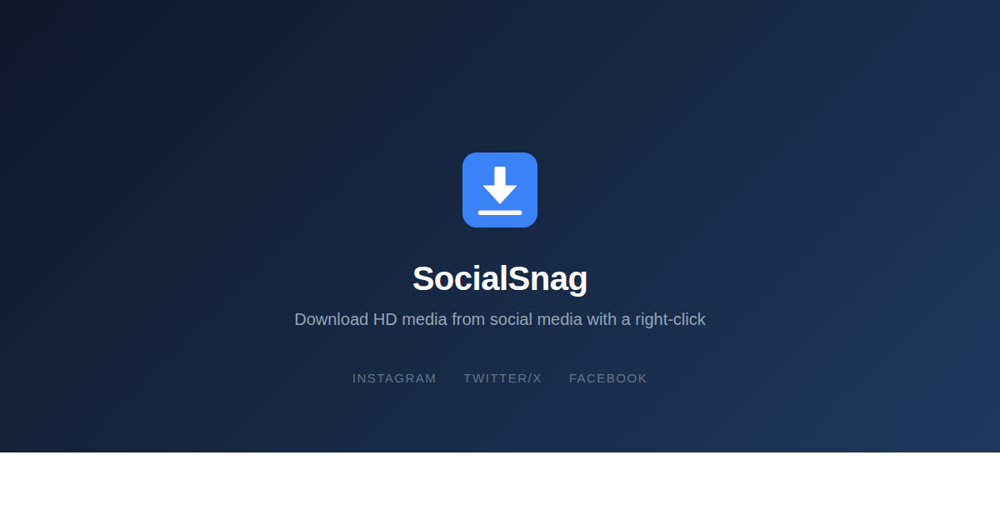

[Project: SocialSnag maintenance](https://github.com/users/jamditis/projects/15)
[](https://chromewebstore.google.com/detail/socialsnag/llbpeneloehnlaomolbalbmhjncpmnfa)


# SocialSnag

Download full-resolution images and videos from social media. Right-click while browsing a supported site, or paste a direct post link into the landing page.

**[View the landing page](https://jamditis.github.io/socialsnag/)**



## Two ways to download

**Right-click while browsing:** Open a supported post, right-click its media, and choose a SocialSnag action from the context menu.

**Paste a post link:** After the supporting extension update is live in the Chrome Web Store, install or update to that current SocialSnag release. Then open the [SocialSnag landing page](https://jamditis.github.io/socialsnag/), paste a direct Instagram, X/Twitter, Facebook, or Bluesky post link, and select **Download media**. The static page delegates the request to that locally installed extension. The extension resolves and downloads the media in your browser, using the platform accounts already signed in to that browser when access is required.

The landing page has no backend. It receives a result containing only the platform, download count, and success or failure status. Resolved CDN URLs and account data stay inside the browser extension. Unsupported links, logged-out sessions, private or inaccessible posts, expired or deleted posts, and rate limits produce a visible failure message.

The GitHub Pages site deployment and the Chrome Web Store extension update are separate release gates. Publish v1.3.0 to the Chrome Web Store first, wait until it is live, and only then deploy the Pages form. The pasted-link workflow is available only after both releases are live and v1.3.0 or newer is installed. An older installed version does not support the form. Right-click use continues to work independently from the landing-page form.

## Features

- **Right-click download:** Use the context menu on any supported page
- **Direct post-link download:** Paste a supported post link into the landing page and delegate the download to the installed extension
- **Download quality** — chooses the largest available file or caps Instagram media and X videos at a selected width
- **Multi-image posts** — download every slide of an Instagram carousel, in order, resolved through Instagram's media API
- **Instagram stories** — download the story you're viewing, or the user's whole active tray
- **Video downloads** — Instagram reels and Twitter/X videos via platform API resolution
- **Copy media URL** — copy the full-resolution URL to your clipboard instead of downloading
- **Zip downloads** — bundle a carousel or story into a single .zip, as a default or per download
- **Download history** — track recent downloads from the popup
- **Organized folders** — files saved to `SocialSnag/<platform>/` automatically
- **Platform toggles** — enable or disable individual platforms from settings
- **Configurable download path** — choose where files are saved within your Downloads folder

## Supported platforms

- Instagram (images, reels, carousels, stories)
- Twitter/X (images, profile pictures, videos)
- Facebook (images, videos)
- Bluesky (images)

## Install

### Chrome Web Store

**[Install from the Chrome Web Store](https://chromewebstore.google.com/detail/socialsnag/llbpeneloehnlaomolbalbmhjncpmnfa)**

### Developer mode

1. Clone and build:
   ```
   git clone https://github.com/jamditis/socialsnag.git
   cd socialsnag
   npm install && npm run build
   ```
2. Open `chrome://extensions` in your browser
3. Enable **Developer mode** (toggle in the top right)
4. Click **Load unpacked** and select the `dist/` folder
5. Navigate to a supported site and right-click any image or video

## Privacy

SocialSnag stores preferences and download history in Chrome and has no developer-operated server. Some settings use Chrome's sync storage and may be synced via Google if Chrome Sync is enabled in your browser. The landing page does not write submitted post URLs to extension storage or send them to a SocialSnag server or another developer-operated server. A submitted value remains visible in the form until you change it or close the page. Resolved CDN URLs and account data do not return to the landing page. Media resolution makes direct requests to the selected platforms and media hosts. There are no analytics scripts or remote logging. See the [privacy policy](https://jamditis.github.io/socialsnag/privacy.html) for local and session-storage details.

## License

MIT. See [LICENSE](LICENSE).
